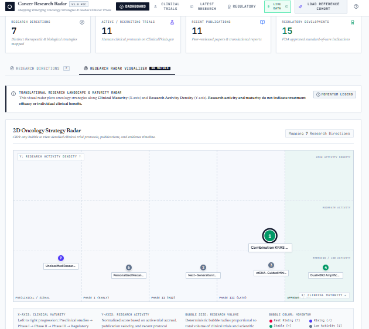
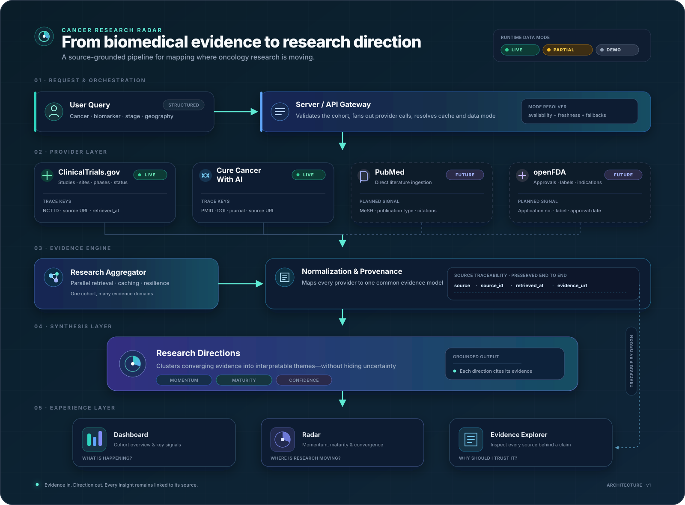
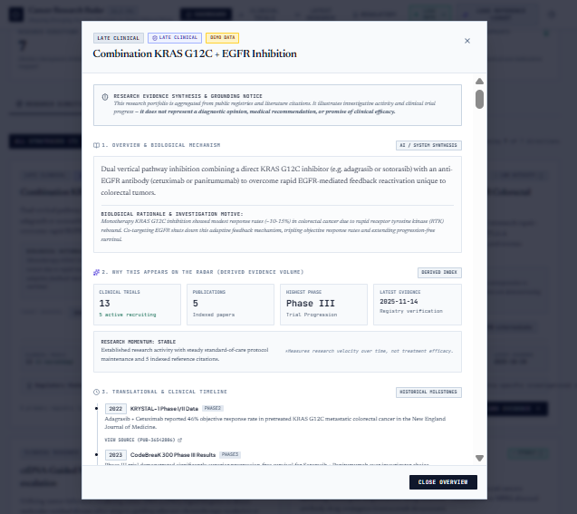
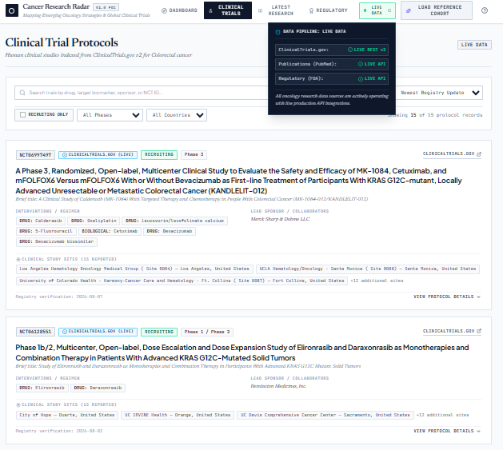

<div align="center">

# Cancer Research Radar

### Mapping emerging oncology research through traceable biomedical evidence

[](https://www.typescriptlang.org/)
[](https://react.dev/)
[](https://tailwindcss.com/)
[](https://expressjs.com/)
[](LICENSE)

[](https://clinicaltrials.gov/data-api/api)
[](https://www.curecancerwithai.com/developers)
[](#project-status)

<br>



</div>

Cancer Research Radar is an open-source biomedical evidence exploration platform that brings together clinical-trial protocols, oncology literature records, regulatory evidence, and AI-assisted synthesis in a unified, source-aware interface.

Instead of returning an undifferentiated list of records, the application organizes retrieved evidence into **research directions** so users can inspect what is being studied, how clinically mature a direction appears, and which records support it.

> **Research question:** For a cancer type, stage, biomarker profile, and geography, which therapeutic strategies are being investigated, what evidence is available, and where are relevant clinical trials registered?

## Engineering highlights

- **Provider-oriented evidence pipeline:** ClinicalTrials.gov, Cure Cancer With AI, demo data, and future providers are separated behind typed interfaces and normalized before reaching the UI.
- **Deterministic descriptive metrics:** Radar maturity, research activity, bubble size, and momentum categories are calculated from explicit heuristics such as phase, trial counts, recruiting ratios, and publication counts—not chosen arbitrarily by an LLM.
- **Server-side integration boundary:** External requests and API credentials remain behind the Express server, while the React interface consumes normalized application endpoints.
- **Traceability-aware models:** Source identifiers and links—including NCT IDs, PMIDs, DOIs, and regulatory references—are retained when the upstream provider supplies them.
- **Visible degradation modes:** The interface distinguishes live, partial-live, demo, and fallback states instead of silently presenting cached or reference data as live evidence.

> [!CAUTION]
> **Cancer Research Radar is a research and software-engineering proof of concept—not a medical device, clinical decision-support system, or source of medical advice.** It does not recommend treatments, determine clinical-trial eligibility, or predict patient benefit. Research activity, maturity, and momentum do not measure safety, efficacy, or likelihood of regulatory approval. Clinical decisions must be made with qualified healthcare professionals using authoritative, current sources.

## Why this project matters

Oncology evidence is distributed across trial registries, publications, and regulatory sources that use different structures and vocabularies. This fragmentation makes it difficult to connect a biological hypothesis with active studies and regulatory context. It also creates opportunities for automated systems to blur important boundaries—for example, between an investigational regimen and an approved indication.

Cancer Research Radar explores an engineering approach built around five principles:

1. **Evidence before synthesis** — retrieve source records before producing higher-level organization.
2. **Traceability by design** — keep identifiers and evidence links attached to normalized records.
3. **Explicit uncertainty** — surface missing fields and provider failures instead of silently filling gaps.
4. **Transparent data modes** — show whether a result is live, partial, demo, or fallback.
5. **Non-prescriptive output** — map research activity without ranking treatments for an individual.

## Product capabilities

- Structured oncology search using cancer type, stage, biomarkers, and geography.
- Live ClinicalTrials.gov v2 retrieval with protocol status, phase, sponsor, interventions, eligibility fields, and study locations when reported.
- Server-side Cure Cancer With AI integration for oncology literature and regulatory records.
- Research-direction synthesis with supporting evidence references.
- Interactive Oncology Strategy Radar.
- Evidence Explorer with trials, publications, regulatory context, timelines, and biomarkers.
- Dedicated Dashboard, Clinical Trials, Latest Research, and Regulatory views.
- Explicit source-level live and fallback labels.
- In-memory caching and graceful provider degradation.
- Direct source links for further verification.

## System architecture

<p align="center">
  
</p>

The server validates a structured cohort query, calls the available providers, normalizes heterogeneous responses into shared domain models, and returns a unified research landscape. The UI consumes those normalized models without implementing provider-specific parsing.

```text
Structured oncology query
          │
          ▼
Node.js / Express API gateway
          │
          ├── ClinicalTrials.gov provider ──► official v2 REST API
          ├── Cure Cancer With AI provider ─► research and regulatory endpoints
          ├── Gemini synthesis service ─────► optional grounded organization layer
          └── Demo provider ────────────────► explicit fallback/reference records
          │
          ▼
Research aggregation and normalization
          │
          ▼
Research directions + provenance metadata
          │
          ├── Dashboard
          ├── Oncology Strategy Radar
          ├── Evidence Explorer
          ├── Clinical Trials
          ├── Latest Research
          └── Regulatory Evidence
```

## Technology stack

| Layer | Current implementation |
|---|---|
| Frontend | React 19, TypeScript 5.8, Vite 6, Tailwind CSS 4, Motion, Lucide React |
| Backend | Node.js, Express 4, TypeScript, tsx in development, esbuild for production bundling |
| Trial registry | ClinicalTrials.gov v2 REST API |
| Literature and regulatory provider | Cure Cancer With AI through server-side endpoints |
| AI-assisted synthesis | Google Gemini through `@google/genai` |
| Local fallback | Curated demo/reference cohorts with explicit status labels |

Version claims above are taken from the repository's current `package.json`, not inferred from the UI.

## Evidence providers and current status

| Provider or layer | Purpose | Authentication | Current status |
|---|---|---:|---|
| [ClinicalTrials.gov](https://clinicaltrials.gov/data-api/api) | Trial protocols, recruitment status, phases, interventions, sponsors, eligibility fields, and locations | None | **Live integration** |
| [Cure Cancer With AI](https://www.curecancerwithai.com/developers) | Oncology literature and regulatory records | Server-side API key | **Live when configured** |
| Google Gemini | Research-direction synthesis and harmonization | Server-side API key | **Available when configured** |
| Demo/reference provider | Clearly labelled offline or fallback records | None | **Fallback** |
| PubMed native provider | Direct NCBI E-utilities ingestion | None | **Prepared adapter only** |
| openFDA native provider | Direct FDA label and regulatory ingestion | Optional key | **Prepared adapter only** |

The current `PubMedProvider` and `OpenFDAProvider` define interfaces and base URLs but return empty arrays. They are therefore documented as roadmap items, not as live native integrations.

## Provenance and data modes

Where the upstream provider supplies them, normalized records retain:

- provider and source type;
- source identifier, such as an NCT ID, PMID, DOI, or regulatory reference;
- original evidence URL;
- retrieval timestamp;
- live, demo, or fallback state.

System-generated groupings, metrics, labels, and summaries are presentation or synthesis layers. They are not original scientific sources and must remain distinguishable from provider data.

| Runtime mode | Meaning |
|---|---|
| **LIVE DATA** | The required configured providers for the current request returned live responses. |
| **PARTIAL LIVE DATA** | At least one provider returned live evidence while another failed, was unavailable, or used a clearly labelled fallback. |
| **DEMO DATA** | The displayed landscape is based on local reference records rather than current provider responses. |
| **DEMO FALLBACK** | A provider or record is represented by an explicitly labelled fallback after a live request could not be completed. |

A `LIVE DATA` badge describes retrieval state for a request. It does **not** imply scientific validation, clinical relevance, treatment efficacy, or patient eligibility.

## How to read the radar

| Visual property | Interpretation |
|---|---|
| Horizontal position | Clinical maturity derived from the available development-stage evidence. |
| Vertical position | Normalized research activity calculated from the retrieved dataset. |
| Bubble size | Relative evidence volume based on trial and publication counts. |
| Bubble color | A deterministic research-momentum category based on explicit heuristics. |

The current metric engine uses transparent thresholds and formulas. These values describe activity in the retrieved dataset; they are not probabilities of clinical success and must not be compared as treatment scores.

## Product showcase

| Evidence Explorer | Live ClinicalTrials.gov results |
|---|---|
|  |  |
| Inspect the source records and quantitative signals behind a research direction. | Explore normalized trial protocols while retaining links to the registry records. |

Only verified repository paths are used above:

```text
docs/screenshots/02-dashboard-radar.png
docs/screenshots/03-evidence-explorer.png
docs/screenshots/04-clinical-trials-live.png
screenshots/architecture.svg
```

## Quick start

### Prerequisites

- Node.js 18 or later
- npm

### Installation

```bash
git clone https://github.com/Docriadhchaker/Cancer-Research-Radar.git
cd Cancer-Research-Radar
npm install
cp .env.example .env
npm run dev
```

On Windows PowerShell, use:

```powershell
Copy-Item .env.example .env
npm run dev
```

Open [http://localhost:3000](http://localhost:3000).

### Validation and production build

```bash
# TypeScript validation
npm run lint

# Frontend and server production build
npm run build

# Run the compiled production server after building
npm start
```

ClinicalTrials.gov requires no API key. Other capabilities depend on the environment variables described below.

## Environment variables

Create `.env` from `.env.example`:

```env
# Required for Gemini-powered synthesis calls
GEMINI_API_KEY="your_gemini_api_key"

# Required for live Cure Cancer With AI literature and regulatory requests
CURE_CANCER_AI_API_KEY="your_cure_cancer_with_ai_api_key"

# Local application URL; AI Studio may inject a hosted URL at runtime
APP_URL="http://localhost:3000"
```

Security requirements:

- never commit `.env`;
- keep only placeholder values in `.env.example`;
- read credentials on the server only;
- never expose secrets through `VITE_*` variables, browser storage, client logs, or client-facing payloads;
- confirm provider failure through visible partial or fallback states rather than claiming a fully live response.

## Project structure

```text
Cancer-Research-Radar/
├── docs/
│   ├── architecture.md
│   ├── data-sources.md
│   ├── safety.md
│   └── screenshots/
│       ├── 02-dashboard-radar.png
│       └── 03-evidence-explorer.png
├── screenshots/
│   └── architecture.svg
├── src/
│   ├── components/
│   ├── data/demo/
│   │   └── metricsCalculator.ts
│   ├── server/
│   ├── services/providers/
│   ├── types/
│   ├── App.tsx
│   └── main.tsx
├── .env.example
├── server.ts
├── package.json
└── README.md
```

The tree above highlights the files most relevant to understanding the architecture; it is not an exhaustive file listing.

## Known limitations

- **Research POC:** the application has not been clinically validated and is not intended for diagnosis, treatment selection, patient triage, or trial matching.
- **Not a systematic review:** results depend on provider coverage, query construction, indexing, availability, rate limits, and retrieval time.
- **Registry limitations:** registered study data may be incomplete, outdated, or missing fields. Registration does not establish study quality or treatment efficacy.
- **Geographic fallback:** when a rare biomarker and location return no locally registered study sites, the application can report the local zero count and surface broader international studies. This does not imply local access or eligibility.
- **Generated research directions:** clusters and summaries are an organizational layer produced by the system, not expert consensus or clinical guidance.
- **Heuristic scoring:** maturity, activity, volume, and momentum are descriptive software metrics—not validated endpoints or probabilities of success.
- **Regulatory interpretation:** an approval must be verified for its precise indication, population, biomarker, regimen, jurisdiction, and date. Regulatory approval is not automatically equivalent to a standard of care.
- **Provider dependency:** upstream outages, timeouts, rate limits, quotas, and schema changes can affect live results.
- **Cache freshness:** in-memory caching can make a response temporarily differ from the latest upstream record.
- **Native provider gaps:** direct PubMed and openFDA adapters are not yet implemented.
- **No public demo link yet:** the repository currently documents local execution; no hosted one-click preview is claimed here.
- **Limited automated verification:** broader tests, continuous integration, reproducible benchmarks, and independent scientific review remain roadmap work.

## Project status

Cancer Research Radar is an open-source research POC. It demonstrates an end-to-end provider architecture and an interactive oncology evidence-exploration workflow, but it should not be described as production-ready clinical software.

### Completed

- [x] Provider abstraction and normalized evidence models
- [x] Live ClinicalTrials.gov v2 integration
- [x] Server-side Cure Cancer With AI integration paths
- [x] Gemini synthesis endpoint
- [x] Explicit live, partial, demo, and fallback modes
- [x] Deterministic radar and momentum heuristics
- [x] Dashboard, Radar, Evidence Explorer, Trials, Research, and Regulatory views
- [x] Source identifiers and evidence links carried into normalized records when supplied
- [x] Server-side credential boundary

### Roadmap

- [ ] Native PubMed ingestion through NCBI E-utilities
- [ ] Native openFDA provider
- [ ] Europe PMC provider
- [ ] Cross-provider deduplication and record reconciliation
- [ ] Stronger indication-, biomarker-, population-, and jurisdiction-aware regulatory matching
- [ ] Geographic radius and travel-time estimation for registered sites
- [ ] Automated provider, normalization, provenance, and data-mode tests
- [ ] Continuous integration with an evidence-backed build badge
- [ ] Reproducible latency and cache benchmarks
- [ ] Public hosted demo
- [ ] Exportable, source-linked evidence reports
- [ ] Independent scientific and usability review

## Documentation

- [Architecture](docs/architecture.md) — provider design, server flow, and normalization boundaries
- [Data sources](docs/data-sources.md) — provider behavior, fields, provenance, and fallbacks
- [Safety](docs/safety.md) — intended use, non-prescriptive boundaries, and scientific cautions

## Contributing

Contributions, bug reports, documentation improvements, and scientific feedback are welcome.

1. Open an issue describing the problem or proposed change.
2. Fork the repository and create a focused branch.
3. Keep provider logic separate from presentation components.
4. Preserve source identifiers, evidence URLs, retrieval state, and data-mode labels.
5. Add or update tests for changes affecting normalization, provenance, or safety messaging.
6. Submit a pull request describing the change, its evidence basis, and any remaining limitations.

Do not commit API keys, patient data, protected health information, or copyrighted source material that the project is not permitted to redistribute.

## Citation

If you use Cancer Research Radar in research, teaching, a presentation, or a software demonstration, please cite the repository:

```bibtex
@software{chaker_cancer_research_radar_2026,
  author  = {Chaker, Riadh},
  title   = {Cancer Research Radar: A Source-Grounded Oncology Evidence Exploration Platform},
  year    = {2026},
  url     = {https://github.com/Docriadhchaker/Cancer-Research-Radar},
  license = {MIT},
  note    = {Open-source research proof of concept}
}
```

## License

Released under the [MIT License](LICENSE).

Copyright © 2026 Dr Riadh Chaker.
