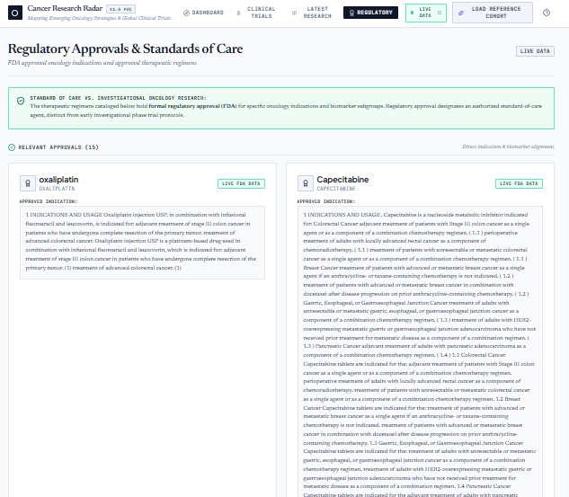

<div align="center">

# Cancer Research Radar

### Mapping emerging oncology research through traceable biomedical evidence

[](LICENSE)
[](https://clinicaltrials.gov/)
[](https://www.curecancerwithai.com/)
[](https://react.dev/)
[](https://www.typescriptlang.org/)
[](https://nodejs.org/)
[](#project-status)

<br>


</div>

Cancer Research Radar is an open-source biomedical evidence exploration platform. It brings together clinical-trial protocols, oncology literature records, and regulatory evidence in a unified, source-aware interface.

Rather than presenting an undifferentiated list of records, the application organizes retrieved evidence into **research directions** so users can explore what is being studied, how clinically mature a direction appears, and which source records support it.

> **Research question:** For a cancer type, stage, biomarker profile, and geography, which therapeutic strategies are being investigated, what evidence is available, and where are relevant clinical trials registered?

> [!CAUTION]
> **Cancer Research Radar is a research and software-engineering proof of concept—not a medical device, clinical decision-support system, or source of medical advice.** It does not recommend treatments, determine clinical-trial eligibility, or predict patient benefit. Research activity, maturity, and momentum do not measure safety, efficacy, or likelihood of regulatory approval. Clinical decisions must be made with qualified healthcare professionals using authoritative, current sources.

## Why this project matters

Oncology evidence is distributed across registries, publications, and regulatory sources that use different structures and vocabularies. This fragmentation makes it difficult to connect a biological hypothesis with active studies and regulatory context. It also creates opportunities for automated systems to blur important boundaries—for example, between an investigational regimen and an approved indication.

Cancer Research Radar explores an engineering approach built around:

- **evidence before synthesis** — source records are retrieved before higher-level organization;
- **traceability by design** — identifiers and source links remain attached to normalized records;
- **explicit uncertainty** — missing fields and provider failures are surfaced rather than silently filled;
- **clear data modes** — live, partial, demo, and fallback states are visible in the interface;
- **non-prescriptive outputs** — the product maps research activity; it does not rank treatments for a patient.

## Features

- **Structured oncology search** using cancer type, stage, biomarker terms, and geography.
- **Live ClinicalTrials.gov integration** through the official v2 REST API, with protocol status, phase, sponsor, interventions, eligibility fields, and study locations when reported.
- **Live Cure Cancer With AI integration** for oncology literature and regulatory records, accessed through the server so credentials do not reach the browser.
- **Research Direction Engine** that groups converging evidence into explorable themes while retaining links to the contributing records.
- **Interactive Oncology Strategy Radar** showing clinical maturity, normalized research activity, evidence volume, and research momentum.
- **Evidence Explorer** connecting each research direction to its supporting trials, literature, regulatory context, timeline, and biomarkers.
- **Dedicated views** for the dashboard, clinical trials, latest research, and regulatory evidence.
- **Deterministic descriptive metrics** for radar placement and momentum categories; these metrics describe activity, not therapeutic value.
- **Geographic fallback transparency** when no study sites match a requested location and broader results are shown.
- **Graceful degradation and caching** with visible per-source status instead of silent mixing of live and demo records.

## System architecture

<p align="center">
  
</p>

The application uses a provider-oriented architecture. The server validates a structured cohort query, retrieves evidence from available providers, normalizes heterogeneous responses into shared domain models, and preserves provenance metadata. The interface consumes the normalized result without needing provider-specific logic.

This separation allows a source to fail or be replaced without requiring a rewrite of the dashboard. It also keeps external API keys in server-side code.

## Evidence, provenance, and data modes

### Current integrations

| Provider or layer | Role | Authentication | Current state |
|---|---|---:|---|
| [ClinicalTrials.gov](https://clinicaltrials.gov/data-api/api) | Trial protocols, recruitment status, phases, interventions, sponsors, eligibility fields, and locations | None | **Live integration** |
| [Cure Cancer With AI](https://www.curecancerwithai.com/developers) | Oncology literature and regulatory records | Server-side API key | **Live integration** |
| Curated reference fixtures | Clearly labelled offline/demo records used when live evidence is unavailable | None | **Fallback only** |
| Google Gemini | Optional server-side assistance for harmonization or synthesis; never treated as a primary biomedical source | Server-side API key | **Optional** |

Direct PubMed and openFDA providers are planned. Until they are implemented, the README does **not** describe them as live native integrations.

### Provenance model

Where a provider supplies the relevant metadata, normalized records retain:

- provider name and source type;
- source identifier, such as an NCT ID, PMID, DOI, or regulatory reference;
- original evidence URL;
- retrieval timestamp;
- live, demo, or fallback status.

System-generated labels, groupings, metrics, and summaries are presentation or synthesis layers. They are not original scientific sources and must remain distinguishable from provider data.

### Runtime data modes

| Mode | Meaning |
|---|---|
| **LIVE DATA** | All required providers for the current request returned live data. |
| **PARTIAL LIVE DATA** | At least one provider returned live data while another was unavailable or used a clearly labelled fallback. |
| **DEMO DATA** | The view is based on local reference fixtures rather than current provider responses. |
| **DEMO FALLBACK** | A specific provider or record is being represented by an explicitly labelled fallback after a live request could not be completed. |

Live and fallback records should never be combined without a visible source-level status. A `LIVE DATA` badge describes provider availability for the request—not scientific validation or clinical relevance.

## How the radar should be read

| Visual property | Interpretation |
|---|---|
| Horizontal position | Clinical maturity derived from available development-stage evidence. |
| Vertical position | Normalized research activity in the retrieved dataset. |
| Bubble size | Relative supporting evidence volume. |
| Bubble color | Research-momentum category calculated from measurable activity signals. |

These are descriptive software metrics. A prominent bubble does not mean that an intervention works, is safe, is available, or is appropriate for an individual.

## Screenshots

### Define an oncology cohort


### Explore the evidence behind a research direction


### Inspect live evidence streams

| Clinical trials | Latest research |
|---|---|
|  |  |

### Review regulatory evidence



## Quick start

### Prerequisites

- Node.js 18 or later
- npm

After cloning the repository:

```bash
cd cancer-research-radar
npm install
cp .env.example .env
npm run dev
```

On Windows PowerShell, use `Copy-Item .env.example .env` instead of `cp .env.example .env` if `cp` is unavailable.

Open [http://localhost:3000](http://localhost:3000). ClinicalTrials.gov does not require an API key, so its live integration can operate without additional credentials.

## Environment variables

Create `.env` from `.env.example` and add only the credentials you intend to use:

```env
# Enables live literature and regulatory retrieval through Cure Cancer With AI
CURE_CANCER_AI_API_KEY=

# Optional: enables server-side AI-assisted harmonization or synthesis
GEMINI_API_KEY=
```

Security requirements:

- keep `.env` out of version control;
- commit only placeholder values in `.env.example`;
- read credentials on the server only;
- never expose secrets through `VITE_*` variables, browser storage, client logs, or client-facing error payloads.

When `CURE_CANCER_AI_API_KEY` is absent or a provider request fails, the application should report the resulting partial or fallback mode rather than claim a fully live response.

## Known limitations

- **Research POC:** the application has not been clinically validated and is not intended for diagnosis, treatment selection, patient triage, or trial matching.
- **Not a systematic review:** search results depend on provider coverage, query construction, indexing, availability, rate limits, and retrieval time.
- **Registry limitations:** registered study data may be incomplete, outdated, or missing fields, and registration does not establish study quality or treatment efficacy.
- **Geographic interpretation:** a listed site may not be open, accessible, or suitable for a user. A broader geographic fallback does not imply local access or eligibility.
- **Generated research directions:** clusters and summaries are an organizational layer produced by the system, not expert consensus or clinical guidance.
- **Descriptive scoring:** maturity, activity, volume, and momentum metrics are not probabilities of success and are not comparative treatment scores.
- **Regulatory context:** an approval must be verified for its precise indication, population, biomarker, regimen, jurisdiction, and date. Regulatory approval is not automatically equivalent to a standard of care.
- **Provider dependency:** live results can be affected by upstream outages, schema changes, timeouts, quotas, or rate limits.
- **Cache freshness:** in-memory caching can make a response differ temporarily from the latest upstream record.
- **AI variability:** optional model-assisted harmonization may be imperfect; users should inspect the underlying source records.

## Project status

Cancer Research Radar is an open-source research POC. The current implementation demonstrates an end-to-end provider architecture and interactive evidence-exploration workflow; it should not be described as production-ready clinical software.

### Completed

- [x] Provider abstraction and normalized evidence models
- [x] Live ClinicalTrials.gov v2 integration
- [x] Live Cure Cancer With AI literature and regulatory integration
- [x] Server-side credential isolation
- [x] Explicit live, partial, demo, and fallback modes
- [x] Research-direction mapping and deterministic activity metrics
- [x] Dashboard, Radar, Evidence Explorer, Trials, Research, and Regulatory views
- [x] Source identifiers and evidence links carried into the interface

### Roadmap

- [ ] Direct PubMed provider
- [ ] Direct openFDA provider
- [ ] Europe PMC provider
- [ ] Cross-provider deduplication and record reconciliation
- [ ] Longitudinal research-activity analysis with documented methodology
- [ ] Stronger indication-, biomarker-, and population-aware regulatory matching
- [ ] Geographic radius and travel-time estimation for registered trial sites
- [ ] Exportable, source-linked evidence reports
- [ ] Automated tests for provider failures, provenance, normalization, and data-mode transitions
- [ ] Independent scientific and usability review

## Documentation

- [Architecture](docs/architecture.md) — provider design, server flow, and normalization boundaries
- [Data sources](docs/data-sources.md) — provider behavior, fields, provenance, and fallbacks
- [Safety](docs/safety.md) — intended use, non-prescriptive boundaries, and scientific cautions

## Contributing

Contributions, bug reports, documentation improvements, and scientific feedback are welcome.

1. Open an issue describing the problem or proposed change.
2. Fork the repository and create a focused branch.
3. Keep provider logic separate from presentation components.
4. Preserve source identifiers, source URLs, retrieval state, and data-mode labels.
5. Add or update tests for behavior that affects normalization, provenance, or safety messaging.
6. Submit a pull request explaining the change, its evidence basis, and any remaining limitations.

Please do not commit API keys, patient data, protected health information, or copyrighted source content that the project is not permitted to redistribute.

## Citation

If you use Cancer Research Radar in research, teaching, a presentation, or a software demonstration, please cite the repository:

```bibtex
@software{chaker_cancer_research_radar_2026,
  author  = {Chaker, Riadh},
  title   = {Cancer Research Radar: A Source-Grounded Oncology Evidence Exploration Platform},
  year    = {2026},
  license = {MIT},
  note    = {Open-source research proof of concept}
}
```

## License

Released under the [MIT License](LICENSE).

Copyright © 2026 Dr Riadh Chaker.
